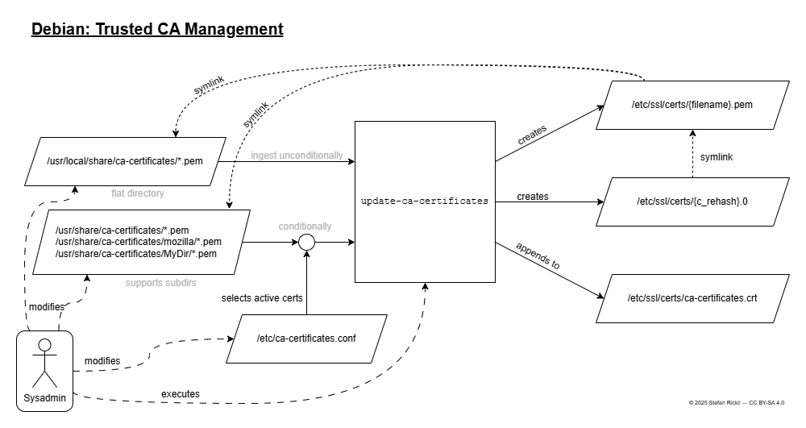
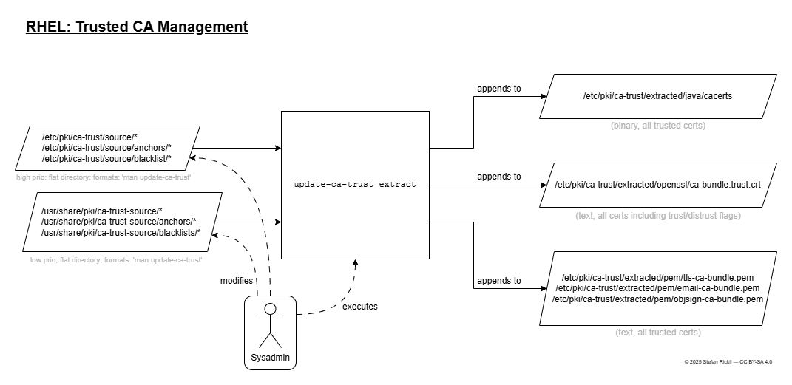

# linux-certificate-updates
Flowcharts that explain how certificates are added to the trust store on Debian/Ubuntu, Fedora/RHEL, using `update-ca-certificates` and `update-ca-trust`.

Disclaimer: May be incomplete or outdated. See [original article](https://blog.stefanrickli.dev/linux-certificate-updates) for details.

Original docs for [Debian/Ubuntu](https://manpages.debian.org/testing/ca-certificates/update-ca-certificates.8.en.html).

Original docs for [Fedora](https://docs.fedoraproject.org/en-US/quick-docs/using-shared-system-certificates/)/[Red Hat Enterprise Linux](https://www.redhat.com/en/blog/configure-ca-trust-list).
